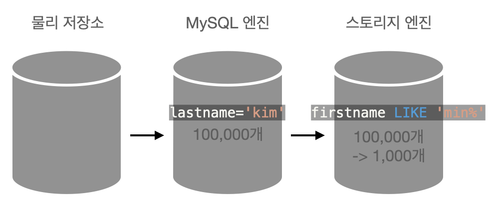
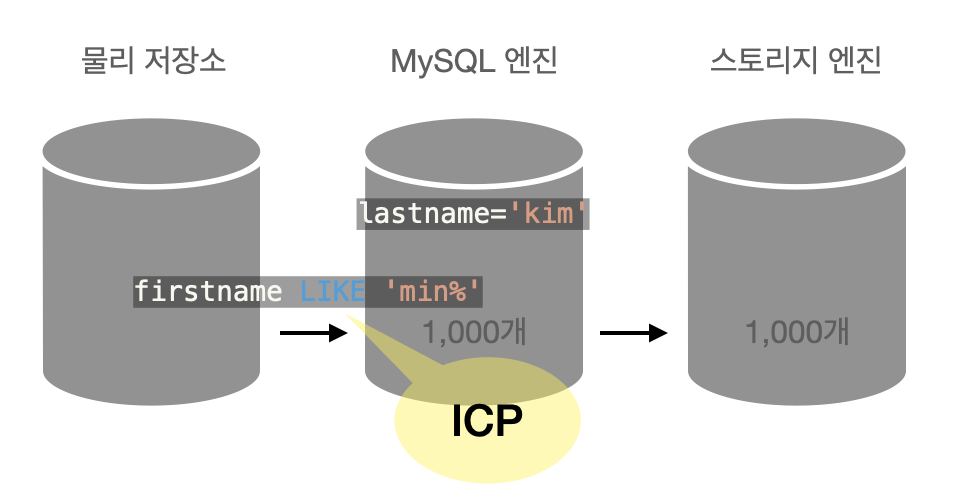
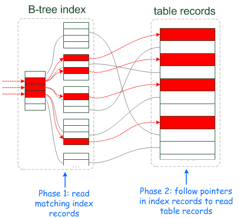
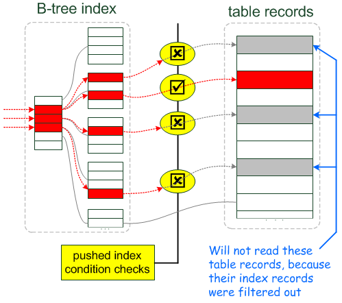

## 0. 글의 순서

- [0. 글의 순서](#0-글의-순서)
- [1. 들어가면서](#1-들어가면서)
- [2. Index Condition Pushdown(ICP)란?](#2-index-condition-pushdownicp란)
  - [MySQL의 내부구조](#mysql의-내부구조)
- [3. ICP의 동작원리](#3-icp의-동작원리)
- [출처](#출처)

## 1. 들어가면서

정말 오랜만에 올리는 포스팅이다. 이직하고 정신없이 적응하고 스터디도 병행하느라  블로깅에 소홀했는데 다시 천천히 시작해보려고 한다.

최근 업무에서 MySQL 데이터베이스 테이블에 새로 추가한 인덱스를 제대로 활용할 수 있는지 실행계획을 분석해볼 일이 있었다.

`Explain` 쿼리를 실행했을 때 `Extra` 컬럼에 `Using index condition` 값이 나왔고 이 값이 `Index Condition Pushdown` 이라는 개념과 연관이 있음을 알게 되었다.

## 2. Index Condition Pushdown(ICP)란?

ICP는 MySQL이 **인덱스**를 사용하는 `SELECT` 쿼리에 대한 최적화이다.

최적화를 했다는 것은 비효율적인 부분이 있다는 것인데 어떤 부분이 비효율적이고, ICP는 이를 어떻게 해결했을까?

### MySQL의 내부구조 

이를 알아보기 전에 MySQL의 내부 구조를 간단하게 살펴보자.

* 출처 : 개발자와 DBA를 위한 Real MySQL

MySQL의 내부구조는 위와 같이 복잡하지만 크게 MySQL 엔진과 스토리지 엔진으로 나눠볼 수 있다.

MySQL 내부는 복잡하게 구성되어 있지만 ICP를 이해하는데 MySQL 엔진과 스토리지 엔진으로 나눠져 있고 아래와 같은 역할을 한다는 것만 알면 된다. (더 자세히 알아보고 싶다면 개발자와 DBA를 위한 Real MySQL을 추천한다.)

- MySQL 엔진
  - 클라이언트와의 커넥션을 담당하고 SQL문을 분석하여 가장 비용이 적은 동작을 계산하여 스토리지 엔진에게 전달한다.

- 스토리지 엔진
  - 실제 데이터를 디스크 스토리지에 저장하거나 디스크 스토리지로부터 데이터를 읽어오는 것을 담당한다.

## 3. ICP의 동작원리

그래서 어떤 부분이 비효율적이고, ICP는 이를 어떻게 해결했을까?

간단한 SQL 예시를 통해 살펴보자.

(`people` 테이블에는 lastname, firstname 인덱스가 걸려있다고 가정)

~~~SQL
SELECT * FROM people WHERE lastname='kim' AND firstname LIKE 'min%'
~~~

상식적으로 인덱스에서 두 개의 조건을 만족하는 데이터만 조회해서 클라이언트에 결과를 돌려주면 되는데, MySQL에서는 이렇게 처리하지 않는다.

MySQL 엔진은 스토리지 엔진에서 `lastname='kim'`라는 조건밖에 전달하지 못한다.

스토리지 엔진은 `firstname LIKE 'min%'` 라는 조건을 알 수 없어서,
일단 `lastname='kim'`를 만족하는 모든 데이터(100,000개)를 물리적인 IO를 통해 읽어온 뒤 MySQL엔진에 전달한다.

그리고 MySQL엔진에서 `firstname LIKE 'min%'` 조건을 적용하여 99%의 데이터를 버리게 되어 실제로 클라이언트에 전달되는 데이터는 1000개 뿐인 것이다.

이러한 비효율적인 동작을 개선하기 위해 WHERE절의 조건(Condition)을 스토리지 엔진에 밀어넣어서(Pushdown) 스토리지 엔진의 IO 횟수와 MySQL 엔진이 스토리지 엔진에 대한 엑세스 횟수를 줄일 수 있게 되는 것이다.

여기까지 해서 스토리지에 조건을 밀었고 이 조건을 인덱스를 통해 물리 디스크에 저장된 데이터를 불러올 때 적용하게 된다. 그림을 통해 더 자세히 알아보자.

디스크 기반의 스토리지 엔진에서 인덱스를 통해 데이터를 읽어올 때 아래와 같은 과정을 거친다.
조건과 일치하는 인덱스를 탐색한 후 이에 대응되는 물리 디스크에 저장된 레코드를 읽어온다.

* 출처 : MariaDB Documentation

ICP가 적용되었을 경우엔, 위에서 알아본 예에서 `lastname='kim'`에 대응되는 
이 조건을 `LIKE 'min%'` 아래 그림의 노란색 부분처럼 스윽 밀어넣어서(Pushdown) 물리 디스크에서 더 적은 데이터를 읽어 들이는 것이다.

* 출처 : MariaDB Documentation

이렇게 해서 Index Condition Pushdown 이라는 이름이 붙게 되었음을 알 수 있다.

요약해보자면, ICP는 인덱스를 통해 데이터를 읽어 들일때 조건(Condition)을 적용(Pushdown)하여 물리 디스크에서 불러오는 데이터의 수와 횟수를 줄이는 최적화 방법이다.

##  출처

- [Index Condition Pushdown Optimization - MySQL Documentation](https://dev.mysql.com/doc/refman/5.6/en/index-condition-pushdown-optimization.html)

- [Index Condition Pushdown - MariaDB Documentation](https://mariadb.com/kb/en/index-condition-pushdown/)

- 개발자와 DBA를 위한 Real MySQL

- [MySQL 5.6 신기능 - Index Condition Pushdown (ICP) - 돌고래 사육사](https://m.blog.naver.com/PostView.naver?isHttpsRedirect=true&blogId=seuis398&logNo=70111486432)